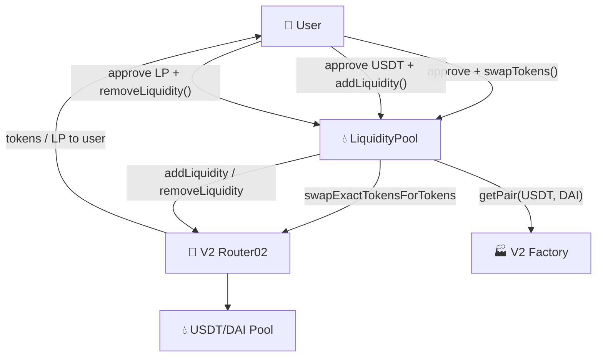

# 💧 LiquidityPool

[](https://github.com/noelialuz/LiquidityPool)
[](https://soliditylang.org/)
[](https://opensource.org/licenses/MIT)
[](https://ethereum.org/)
[](https://getfoundry.sh/)

> **A Foundry project that wraps Uniswap V2 Router02 to swap tokens and manage USDT/DAI liquidity — add liquidity in one call and remove it when exiting a position.**

LiquidityPool is a learning-oriented Solidity smart contract that integrates with an existing **Uniswap V2–compatible router and factory** on the EVM. Users can swap ERC-20 tokens through a single entry point, deposit into the **USDT/DAI** pool via a convenience `addLiquidity` flow (half USDT is swapped to DAI automatically), and remove LP tokens to recover underlying assets.

The contract uses **OpenZeppelin SafeERC20** for token transfers and approvals, emits events for swaps and liquidity additions, and is tested against an **Arbitrum mainnet fork** with real on-chain addresses.

**Key features:**

- 🔁 `swapTokens()` — wraps `swapExactTokensForTokens` with configurable recipient
- 💧 `addLiquidity()` — splits USDT input, swaps half to DAI, then adds liquidity to the pair
- 🚪 `removeLiquidity()` — burns LP tokens and returns USDT/DAI to a chosen address
- 🧩 Minimal `IV2Router02` and `IFactory` interfaces
- 🛡️ **SafeERC20** for `transferFrom` and `approve`
- 📣 Events: `SwapTokens`, `AddLiquidity`
- 🧪 Foundry test suite with **Arbitrum mainnet fork**
- 🔗 Configurable router, factory, and token addresses set at deploy time

---

## 📋 Table of Contents

1. [Prerequisites & Dependencies](#-prerequisites--dependencies)
2. [Technologies & Versions](#-technologies--versions)
3. [Project Structure](#-project-structure)
4. [Quick Start](#-quick-start)
5. [Testing the Contract](#-testing-the-contract)
6. [Architecture](#-architecture)
7. [Security Policy](#-security-policy)
8. [Scripts & Commands](#-scripts--commands)
9. [Versioning](#-versioning)
10. [License](#-license)
11. [About the Author](#-about-the-author)

---

## 📦 Prerequisites & Dependencies

### System requirements

| Requirement | Notes |
| :-- | :-- |
| 🖥️ **OS** | macOS, Linux, or Windows |
| 🔧 **Git** | Required for cloning and submodules |
| ⚒️ **Foundry** | `forge`, `cast`, and `anvil` for build and test |
| 🌐 **RPC URL** | Arbitrum endpoint for fork tests |
| 🌐 **Browser** | Modern browser for [Remix IDE](https://remix.ethereum.org/) |

**Quick minimum:** [Foundry](https://getfoundry.sh/) installed and Solidity compiler **0.8.24**.

### Install Foundry

```bash
curl -L https://foundry.paradigm.xyz | bash
foundryup
```

Verify:

```bash
forge --version
cast --version
```

### Project dependencies

| Dependency | Role |
| :-- | :-- |
| [forge-std](https://github.com/foundry-rs/forge-std) | Foundry testing utilities and cheatcodes |
| [OpenZeppelin Contracts](https://github.com/OpenZeppelin/openzeppelin-contracts) | `IERC20` and `SafeERC20` for safe token transfers |

After cloning:

```bash
git clone https://github.com/noelialuz/LiquidityPool.git
cd LiquidityPool
forge install
```

---

## 🛠 Technologies & Versions

| Technology | Version | Role |
| :-- | :-- | :-- |
| **Solidity** | `0.8.24` | Smart contract language |
| **Foundry** | latest (`foundryup`) | Build, test, and CLI interaction |
| **OpenZeppelin Contracts** | vendored in `lib/` | ERC-20 interfaces and SafeERC20 |
| **Uniswap V2 Router02** | external (on-chain) | DEX router for swaps and liquidity |
| **Uniswap V2 Factory** | external (on-chain) | Resolves USDT/DAI pair (LP token) address |
| **EVM** | — | Execution environment (Ethereum-compatible chains) |
| **SPDX** | `MIT` | License identifier in source |

---

## 📁 Project Structure

```bash
LiquidityPool/
├── foundry.toml
├── README.md
├── lib/
│   ├── forge-std/
│   └── openzeppelin-contracts/
├── src/
│   ├── SwapApp.sol
│   └── interfaces/
│       ├── IV2Router02.sol
│       └── IFactory.sol
├── test/
│   └── SwapApp.t.sol
└── .vscode/
```

LiquidityPool is a **Foundry-first** project. The Uniswap V2 router and factory are not deployed here — the `SwapApp` contract is configured with existing on-chain addresses for your target network.

---

## 🚀 Quick Start

### 1. Clone and build

```bash
git clone https://github.com/noelialuz/LiquidityPool.git
cd LiquidityPool
forge build
```

### 2. Deploy

Deploy the `SwapApp` contract with the Router02, Factory, USDT, and DAI addresses for your network.

**Arbitrum mainnet:**

| Field | Value |
| :-- | :-- |
| **Contract** | `SwapApp` |
| **`V2Router02Address_`** | `0x4752ba5DBc23f44D87826276BF6Fd6b1C372aD24` |
| **`UniswapFactoryAddress_`** | `0xf1D7CC64Fb4452F05c498126312eBE29f30Fbcf9` |
| **`USDT_`** | `0xFd086bC7CD5C481DCC9C85ebE478A1C0b69FCbb9` |
| **`DAI_`** | `0xDA10009cBd5D07dd0CeCc66161FC93D7c9000da1` |

Using Foundry:

```bash
anvil &
forge create src/SwapApp.sol:SwapApp \
  --rpc-url http://127.0.0.1:8545 \
  --private-key <DEPLOYER_PRIVATE_KEY> \
  --constructor-args \
    0x4752ba5DBc23f44D87826276BF6Fd6b1C372aD24 \
    0xf1D7CC64Fb4452F05c498126312eBE29f30Fbcf9 \
    0xFd086bC7CD5C481DCC9C85ebE478A1C0b69FCbb9 \
    0xDA10009cBd5D07dd0CeCc66161FC93D7c9000da1
```

Use the correct router, factory, and token addresses for your chain. The values above match the Arbitrum fork tests in [`test/SwapApp.t.sol`](./test/SwapApp.t.sol).

### 3. Usage

**Swap USDT for DAI:**

```solidity
IERC20(USDT).approve(liquidityPoolAddress, amountIn);

address[] memory path = new address[](2);
path[0] = USDT;
path[1] = DAI;

liquidityPool.swapTokens(amountIn, amountOutMin, path, msg.sender, deadline);
```

**Add liquidity with USDT only:**

```solidity
IERC20(USDT).approve(liquidityPoolAddress, amountIn);

address[] memory path = new address[](2);
path[0] = USDT;
path[1] = DAI;

liquidityPool.addLiquidity(amountIn, amountOutMin, path, amountAMin, amountBMin, deadline);
```

**Remove liquidity:**

```solidity
IERC20(lpTokenAddress).approve(liquidityPoolAddress, liquidityAmount);

liquidityPool.removeLiquidity(liquidityAmount, amountAMin, amountBMin, msg.sender, deadline);
```

---

## 🧪 Testing the Contract

Fork tests impersonate a known USDT holder on Arbitrum mainnet (`0xB45323118e29e3C33c4a906dD8ce9d9CF443D380`).

### Local tests (no fork)

```bash
forge test -vv
```

Runs `testHasBeenDeployedCorrectly` only. Swap and liquidity integration tests require an Arbitrum fork.

### Arbitrum fork tests

```bash
forge test -vvvv \
  --fork-url https://arb1.arbitrum.io/rpc \
  --match-test testSwapTokensCorrectly
```

Full suite on a fork:

```bash
forge test -vv --fork-url https://arb1.arbitrum.io/rpc
```

### Swap tokens (`swapTokens`)

| Step | Action |
| :-- | :-- |
| 1 | Deploy `SwapApp` with Arbitrum addresses |
| 2 | Impersonate the USDT holder from the test file |
| 3 | Approve LiquidityPool for `amountIn` USDT |
| 4 | Call `swapTokens(amountIn, amountOutMin, [USDT, DAI], user, deadline)` |
| 5 | Assert USDT balance decreased and DAI balance increased |

### Add liquidity (`addLiquidity`)

| Step | Action |
| :-- | :-- |
| 1 | Impersonate the USDT holder from the test file |
| 2 | Approve LiquidityPool for `amountIn_` USDT |
| 3 | Call `addLiquidity(amountIn_, amountOutMin_, [USDT, DAI], amountAMin_, amountBMin_, deadline_)` |
| 4 | Contract swaps half USDT to DAI, then calls router `addLiquidity` |
| 5 | LP tokens are sent to `msg.sender`; `AddLiquidity` event is emitted |

Edge cases:

- Insufficient USDT allowance → SafeERC20 transfer reverts
- `amountOutMin_` too high after swap → router slippage revert
- `amountAMin_` / `amountBMin_` too high → router liquidity revert
- Expired `deadline_` → router `"EXPIRED"` revert

### Remove liquidity (`removeLiquidity`)

| Step | Action |
| :-- | :-- |
| 1 | User holds USDT/DAI LP tokens from a prior `addLiquidity` |
| 2 | Approve LP token to LiquidityPool for `liquidityAmount_` |
| 3 | Call `removeLiquidity(liquidityAmount_, amountAMin_, amountBMin_, to_, deadline_)` |
| 4 | Underlying USDT and DAI are sent to `to_` |

Fork tests depend on live chain state. If the hard-coded holder address no longer has USDT, update `user` in [`test/SwapApp.t.sol`](./test/SwapApp.t.sol).

### Manual interaction with `cast`

```bash
cast send $USDT "approve(address,uint256)" $LIQUIDITY_POOL $AMOUNT_IN --private-key $USER_PK

cast send $LIQUIDITY_POOL \
  "swapTokens(uint256,uint256,address[],address,uint256)" \
  $AMOUNT_IN \
  $AMOUNT_OUT_MIN \
  "[$USDT,$DAI]" \
  $RECIPIENT \
  $DEADLINE \
  --private-key $USER_PK

cast send $LIQUIDITY_POOL \
  "addLiquidity(uint256,uint256,address[],uint256,uint256,uint256)" \
  $AMOUNT_IN \
  $AMOUNT_OUT_MIN \
  "[$USDT,$DAI]" \
  $AMOUNT_A_MIN \
  $AMOUNT_B_MIN \
  $DEADLINE \
  --private-key $USER_PK

cast send $LP_TOKEN "approve(address,uint256)" $LIQUIDITY_POOL $LP_AMOUNT --private-key $USER_PK

cast send $LIQUIDITY_POOL \
  "removeLiquidity(uint256,uint256,uint256,address,uint256)" \
  $LP_AMOUNT \
  $AMOUNT_A_MIN \
  $AMOUNT_B_MIN \
  $RECIPIENT \
  $DEADLINE \
  --private-key $USER_PK
```

### Remix

1. Copy [`src/SwapApp.sol`](./src/SwapApp.sol) and the files under [`src/interfaces/`](./src/interfaces/) into Remix.
2. Add OpenZeppelin imports via Remix GitHub import or flatten the contract.
3. Compile with Solidity **0.8.24**.
4. Deploy with your network's router, factory, USDT, and DAI addresses.
5. Approve tokens to the deployed contract, then call `swapTokens`, `addLiquidity`, or `removeLiquidity`.

---

## 🗄 Architecture

LiquidityPool sits between the user and on-chain Uniswap V2 infrastructure:



### Contract responsibilities

| Contract / Interface | Responsibility |
| :-- | :-- |
| **`SwapApp`** | Token swaps, automated half-swap + liquidity add, liquidity removal |
| **`IV2Router02`** | Minimal interface for swap and liquidity router functions |
| **`IFactory`** | Resolves the USDT/DAI pair address for LP token operations |

### Core state

| Variable | Visibility | Description |
| :-- | :-- | :-- |
| `V2Router02Address` | `public` | Uniswap V2–compatible router address |
| `UniswapFactoryAddress` | `public` | Uniswap V2 factory address |
| `USDT` | `public` | USDT token address for the configured pair |
| `DAI` | `public` | DAI token address for the configured pair |

### Write functions

| Function | Access | Description |
| :-- | :-- | :-- |
| `swapTokens(uint256 amountIn_, uint256 amountOutMin_, address[] path_, address to_, uint256 deadline_)` | `public` | Pulls input token, swaps via router, sends output to `to_` |
| `addLiquidity(uint256 amountIn_, uint256 amountOutMin_, address[] path_, uint256 amountAMin_, uint256 amountBMin_, uint256 deadline_)` | `external` | Swaps half USDT to DAI, then adds both tokens to the pool |
| `removeLiquidity(uint256 liquidityAmount_, uint256 amountAMin_, uint256 amountBMin_, address to_, uint256 deadline_)` | `external` | Burns LP tokens and returns USDT/DAI to `to_` |

### Events

```solidity
event SwapTokens(address tokenIn, address tokenOut, uint256 amountIn, uint256 amountOut);
event AddLiquidity(address token0, address token1, uint256 lpTokenAmount);
```

### Swap flow

1. **Approve** — User grants LiquidityPool allowance on the input ERC-20.
2. **Transfer in** — Contract pulls tokens from `msg.sender` using SafeERC20.
3. **Router approve** — Contract approves the router to spend tokens.
4. **Swap** — Router executes `swapExactTokensForTokens`; output goes to `to_`.
5. **Event** — `SwapTokens` logs token addresses and amounts.

### Add liquidity flow

1. **Transfer USDT** — User approves and sends `amountIn_` USDT; contract pulls `amountIn_ / 2`.
2. **Internal swap** — `swapTokens` converts half USDT to DAI; output stays in the contract.
3. **Add to pool** — Contract approves router for remaining USDT and swapped DAI, then calls `addLiquidity`.
4. **LP tokens** — Minted LP tokens are sent to `msg.sender`.

### Remove liquidity flow

1. **Resolve pair** — `IFactory.getPair(USDT, DAI)` returns the LP token address.
2. **Approve LP** — User approves LiquidityPool to spend LP tokens.
3. **Remove** — Router `removeLiquidity` burns LP and sends USDT/DAI to `to_`.

### Parameters

| Parameter | Used in | Description |
| :-- | :-- | :-- |
| `amountIn_` | swap, add | Exact input amount (USDT for add liquidity) |
| `amountOutMin_` | swap, add | Minimum acceptable swap output (slippage protection) |
| `path_` | swap, add | Token path, e.g. `[USDT, DAI]` |
| `to_` | swap, remove | Recipient of output tokens |
| `amountAMin_` / `amountBMin_` | add, remove | Minimum USDT/DAI amounts (slippage protection) |
| `liquidityAmount_` | remove | LP tokens to burn |
| `deadline_` | all | Unix timestamp after which the transaction reverts |

---

## 🔐 Security Policy

> ⚠️ **This project is intended for learning and demonstration purposes only.** It has **not** undergone a professional security audit.

### Known considerations

| Area | Detail |
| :-- | :-- |
| 🎓 **Educational scope** | Not production-ready; use at your own risk |
| 🔗 **External router trust** | All operations depend on the configured Router02, Factory, and underlying pools |
| 🔒 **Fixed token pair** | `USDT` and `DAI` are set at deploy time; not configurable after construction |
| 💸 **No fee-on-transfer handling** | Assumes standard ERC-20 behavior; deflationary/rebasing tokens may break swaps |
| ⏱️ **Deadline & slippage** | Caller must set sensible deadlines and minimum amounts; no defaults enforced |
| 🔓 **Token approvals** | Contract approves the router per operation |
| 🔄 **Internal swap in addLiquidity** | `addLiquidity` calls the public `swapTokens` |
| 🌐 **Network-specific** | Router, factory, and token addresses differ per chain |
| 🧪 **Test first** | Use fork tests or a testnet before mainnet |

### Before using in production

- [ ] Review all logic in [`src/SwapApp.sol`](./src/SwapApp.sol)
- [ ] Run fork tests against your target chain, router, and factory
- [ ] Consider a professional audit
- [ ] Add pausing, access control, or configurable token pairs if needed
- [ ] Validate liquidity, paths, and slippage parameters on-chain

### Reporting vulnerabilities

If you discover a security issue, please **do not** open a public GitHub issue. Contact the repository owner directly (see [About the Author](#-about-the-author)).

Smart contracts carry inherent technical and financial risk. Use this repository at your own responsibility.

---

## 📜 Scripts & Commands

| Command | Description |
| :-- | :-- |
| `forge build` | Compile contracts |
| `forge test -vv` | Run local deployment test |
| `forge test --fork-url https://arb1.arbitrum.io/rpc` | Run full suite on Arbitrum fork |
| `forge test -vvvv --fork-url https://arb1.arbitrum.io/rpc --match-test testSwapTokensCorrectly` | Verbose swap fork test |
| `forge test -vvvv --fork-url https://arb1.arbitrum.io/rpc --match-test testCanAddLiquidityCorrectly` | Verbose add-liquidity fork test |
| `forge create src/SwapApp.sol:SwapApp --constructor-args <ROUTER> <FACTORY> <USDT> <DAI>` | Deploy via CLI |
| `anvil` | Start a local Ethereum node |
| `cast send ... "swapTokens(...)"` | Execute a swap |
| `cast send ... "addLiquidity(...)"` | Add USDT/DAI liquidity |
| `cast send ... "removeLiquidity(...)"` | Remove liquidity from the USDT/DAI pair |

---

## 📌 Versioning

This project follows **[Semantic Versioning 2.0.0](https://semver.org/)**:

| Segment | Meaning |
| :-- | :-- |
| **MAJOR** | Breaking changes to contract interface or behavior |
| **MINOR** | New features, backward-compatible |
| **PATCH** | Bug fixes, docs, no breaking API changes |

### Release history

| Version | Status | Notes |
| :-- | :-- | :-- |
| **0.1.0** | Current | Initial release: swap, add/remove liquidity, Arbitrum fork tests |

Tag releases on GitHub:

```bash
git tag -a v0.1.0 -m "Initial LiquidityPool release"
git push origin v0.1.0
```

---

## 📄 License

LiquidityPool is released under the **MIT License** — see the SPDX header in [`src/SwapApp.sol`](./src/SwapApp.sol).

SPDX identifier: `MIT`

---

## 👤 About the Author

| | |
| :-- | :-- |
| **Name** | Noelia Luz Fernández |
| **GitHub** | [@Noelialuz](https://github.com/noelialuz) |
| **LinkedIn** | https://www.linkedin.com/in/noelia-luz-fernandez-03404440/ |
| **Email** | noelia_luz_fernandez@hotmail.com |

---

## 📚 Learn More

- [Foundry Book](https://book.getfoundry.sh/)
- [Uniswap V2 documentation](https://docs.uniswap.org/contracts/v2/overview)
- [OpenZeppelin SafeERC20](https://docs.openzeppelin.com/contracts/api/token/erc20#SafeERC20)
- [Solidity documentation](https://docs.soliditylang.org/)
- [Remix IDE documentation](https://docs.remix-project.org/)
