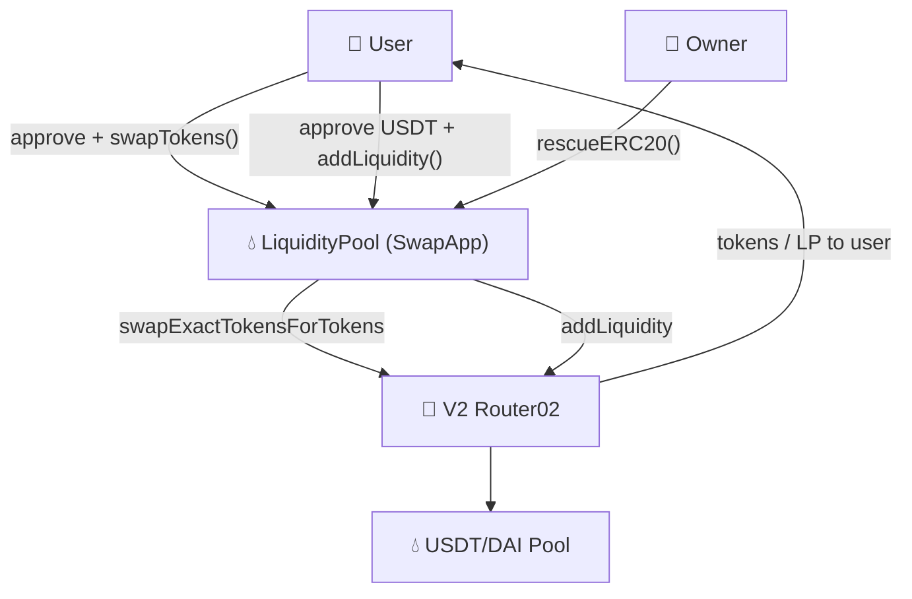

# 💧 LiquidityPool

[](https://github.com/noelialuz/LiquidityPool)
[](https://soliditylang.org/)
[](https://opensource.org/licenses/MIT)
[](https://ethereum.org/)
[](https://getfoundry.sh/)

> **A Foundry project that wraps Uniswap V2 Router02 to swap tokens and open a USDT/DAI LP position from a single-token deposit.**

LiquidityPool is a learning-oriented Solidity smart contract ([`src/SwapApp.sol`](./src/SwapApp.sol)) that integrates with an existing **Uniswap V2–compatible router and factory** on the EVM. Users can swap ERC-20 tokens through a single entry point, or deposit **USDT only** via `addLiquidity`: part of the input is swapped to DAI internally, then both tokens are added to the pool and LP tokens are minted to the caller.

The contract inherits **OpenZeppelin `ReentrancyGuard`** and **`Ownable`**, uses **SafeERC20** with `forceApprove`, refunds leftover tokens after adding liquidity, and exposes an owner-only `rescueERC20` recovery function.

**Key features:**

- 🔁 [`swapTokens()`](./src/SwapApp.sol) — wraps `swapExactTokensForTokens` with configurable recipient
- 💧 [`addLiquidity()`](./src/SwapApp.sol) — swaps a configurable USDT portion to DAI, then adds both tokens to the pool
- 🛡️ **ReentrancyGuard** on state-changing functions
- 👤 **Ownable** with [`rescueERC20()`](./src/SwapApp.sol) for stuck token recovery
- 🧩 Minimal [`IV2Router02`](./src/interfaces/IV2Router02.sol) and [`IFactory`](./src/interfaces/IFactory.sol) interfaces
- 📣 Indexed events: `SwapTokens`, `AddLiquidity`
- 🧪 Foundry test suite in [`test/SwapApp.t.sol`](./test/SwapApp.t.sol)
- 🔗 Immutable router, factory, and token addresses set at deploy time

---

## 📋 Table of Contents

1. [Prerequisites & Dependencies](#-prerequisites--dependencies)
2. [Technologies & Versions](#-technologies--versions)
3. [Project Structure](#-project-structure)
4. [Quick Start](#-quick-start)
5. [Testing the Contract](#-testing-the-contract)
6. [Architecture](#-architecture)
7. [Security Policy](#-security-policy)
8. [Scripts & Commands](#-scripts--commands)
9. [Versioning](#-versioning)
10. [License](#-license)
11. [About the Author](#-about-the-author)

---

## 📦 Prerequisites & Dependencies

### System requirements

| Requirement | Notes |
| :-- | :-- |
| 🖥️ **OS** | macOS, Linux, or Windows |
| 🔧 **Git** | Required for cloning and submodules |
| ⚒️ **Foundry** | `forge`, `cast`, and `anvil` for build and test |
| 🌐 **RPC URL** | Arbitrum endpoint for fork-based integration tests |
| 🌐 **Browser** | Modern browser for [Remix IDE](https://remix.ethereum.org/) |

**Quick minimum:** [Foundry](https://getfoundry.sh/) installed and Solidity compiler **0.8.35**.

### Install Foundry

```bash
curl -L https://foundry.paradigm.xyz | bash
foundryup
```

Verify:

```bash
forge --version
cast --version
```

### Project dependencies

| Dependency | Role |
| :-- | :-- |
| [forge-std](https://github.com/foundry-rs/forge-std) | Foundry testing utilities and cheatcodes |
| [OpenZeppelin Contracts](https://github.com/OpenZeppelin/openzeppelin-contracts) | [`IERC20`](./lib/openzeppelin-contracts/contracts/token/ERC20/IERC20.sol), [`SafeERC20`](./lib/openzeppelin-contracts/contracts/token/ERC20/utils/SafeERC20.sol), [`ReentrancyGuard`](./lib/openzeppelin-contracts/contracts/utils/ReentrancyGuard.sol), [`Ownable`](./lib/openzeppelin-contracts/contracts/access/Ownable.sol) |

After cloning:

```bash
git clone https://github.com/noelialuz/LiquidityPool.git
cd LiquidityPool
forge install
```

---

## 🛠 Technologies & Versions

| Technology | Version | Role |
| :-- | :-- | :-- |
| **Solidity** | `0.8.35` | Smart contract language |
| **Foundry** | latest (`foundryup`) | Build, test, and CLI interaction |
| **OpenZeppelin Contracts** | vendored in `lib/` | SafeERC20, ReentrancyGuard, Ownable |
| **Uniswap V2 Router02** | external (on-chain) | DEX router for swaps and liquidity |
| **Uniswap V2 Factory** | external (on-chain) | Resolves USDT/DAI pair address |
| **EVM** | — | Execution environment (Ethereum-compatible chains) |
| **SPDX** | `MIT` | License identifier in source |

---

## 📁 Project Structure

```bash
LiquidityPool/
├── foundry.toml
├── README.md
├── lib/
│   ├── forge-std/
│   └── openzeppelin-contracts/
├── src/
│   ├── SwapApp.sol
│   └── interfaces/
│       ├── IV2Router02.sol
│       └── IFactory.sol
├── test/
│   └── SwapApp.t.sol
└── .vscode/
```

LiquidityPool is a **Foundry-first** project. The Uniswap V2 router and factory are not deployed here — [`SwapApp`](./src/SwapApp.sol) is configured with existing on-chain addresses for your target network.

---

## 🚀 Quick Start

### 1. Clone and build

```bash
git clone https://github.com/noelialuz/LiquidityPool.git
cd LiquidityPool
forge build
```

### 2. Deploy

Deploy [`SwapApp`](./src/SwapApp.sol) with the Router02, Factory, USDT, and DAI addresses for your network. The deployer becomes the contract owner via [`Ownable`](./lib/openzeppelin-contracts/contracts/access/Ownable.sol).

**Arbitrum mainnet:**

| Field | Value |
| :-- | :-- |
| **Contract** | [`SwapApp`](./src/SwapApp.sol) |
| **`_router`** | `0x4752ba5DBc23f44D87826276BF6Fd6b1C372aD24` |
| **`_factory`** | `0xf1D7CC64Fb4452F05c498126312eBE29f30Fbcf9` |
| **`_usdt`** | `0xFd086bC7CD5C481DCC9C85ebE478A1C0b69FCbb9` |
| **`_dai`** | `0xDA10009cBd5D07dd0CeCc66161FC93D7c9000da1` |

Using Foundry:

```bash
anvil &
forge create src/SwapApp.sol:SwapApp \
  --rpc-url http://127.0.0.1:8545 \
  --private-key <DEPLOYER_PRIVATE_KEY> \
  --constructor-args \
    0x4752ba5DBc23f44D87826276BF6Fd6b1C372aD24 \
    0xf1D7CC64Fb4452F05c498126312eBE29f30Fbcf9 \
    0xFd086bC7CD5C481DCC9C85ebE478A1C0b69FCbb9 \
    0xDA10009cBd5D07dd0CeCc66161FC93D7c9000da1
```

Use the correct router, factory, and token addresses for your chain. The values above match the constants in [`test/SwapApp.t.sol`](./test/SwapApp.t.sol).

### 3. Usage

**Swap USDT for DAI:**

```solidity
IERC20(USDT).approve(liquidityPoolAddress, amountIn);

address[] memory path = new address[](2);
path[0] = USDT;
path[1] = DAI;

liquidityPool.swapTokens(amountIn, amountOutMin, path, msg.sender, deadline);
```

**Add liquidity with USDT only:**

```solidity
IERC20(USDT).approve(liquidityPoolAddress, amountIn);

address[] memory path = new address[](2);
path[0] = USDT;
path[1] = DAI;

liquidityPool.addLiquidity(amountIn, amountSwap, amountOutMin, path, amountAMin, amountBMin, deadline);
```

**Owner — recover stuck tokens:**

```solidity
liquidityPool.rescueERC20(tokenAddress, amount);
```

Before calling `addLiquidity` or `swapTokens` from a frontend, query the router's `getAmountsOut` to compute a safe `amountOutMin` with your desired slippage tolerance.

---

## 🧪 Testing the Contract

Tests live in [`test/SwapApp.t.sol`](./test/SwapApp.t.sol).

### Local tests

```bash
forge test -vv
```

Runs `testRescueFunction`, which verifies that the contract owner can recover ERC-20 tokens sent to the contract via [`rescueERC20()`](./src/SwapApp.sol).

### Arbitrum fork tests

For swap and add-liquidity integration tests against live pool state, run against an Arbitrum fork:

```bash
forge test -vv --fork-url https://arb1.arbitrum.io/rpc
```

### Swap tokens (`swapTokens`)

| Step | Action |
| :-- | :-- |
| 1 | Deploy [`SwapApp`](./src/SwapApp.sol) with Arbitrum addresses |
| 2 | Impersonate a funded USDT holder |
| 3 | Approve LiquidityPool for `amountIn` USDT |
| 4 | Call `swapTokens(amountIn, amountOutMin, [USDT, DAI], recipient, deadline)` |
| 5 | Assert USDT balance decreased and DAI balance increased |

### Add liquidity (`addLiquidity`)

| Step | Action |
| :-- | :-- |
| 1 | Impersonate a funded USDT holder |
| 2 | Approve LiquidityPool for `amountIn_` USDT |
| 3 | Call `addLiquidity(amountIn_, amountSwap_, amountOutMin_, [USDT, DAI], amountAMin_, amountBMin_, deadline_)` |
| 4 | Contract swaps `amountSwap_` USDT to DAI, then adds `usdtRemaining` + DAI to the pool |
| 5 | LP tokens are sent to `msg.sender`; leftover USDT/DAI are refunded |

Edge cases:

- Zero address in constructor → `"Invalid address"`
- Insufficient USDT allowance → SafeERC20 transfer reverts
- `amountOutMin_` too high after swap → router slippage revert
- `amountAMin_` / `amountBMin_` too high → router liquidity revert
- Expired `deadline_` → router `"EXPIRED"` revert
- Non-owner calling `rescueERC20` → Ownable revert

### Manual interaction with `cast`

```bash
cast send $USDT "approve(address,uint256)" $LIQUIDITY_POOL $AMOUNT_IN --private-key $USER_PK

cast send $LIQUIDITY_POOL \
  "swapTokens(uint256,uint256,address[],address,uint256)" \
  $AMOUNT_IN \
  $AMOUNT_OUT_MIN \
  "[$USDT,$DAI]" \
  $RECIPIENT \
  $DEADLINE \
  --private-key $USER_PK

cast send $LIQUIDITY_POOL \
  "addLiquidity(uint256,uint256,uint256,address[],uint256,uint256,uint256)" \
  $AMOUNT_IN \
  $AMOUNT_SWAP \
  $AMOUNT_OUT_MIN \
  "[$USDT,$DAI]" \
  $AMOUNT_A_MIN \
  $AMOUNT_B_MIN \
  $DEADLINE \
  --private-key $USER_PK

cast send $LIQUIDITY_POOL \
  "rescueERC20(address,uint256)" \
  $TOKEN \
  $AMOUNT \
  --private-key $OWNER_PK
```

### Remix

1. Copy [`src/SwapApp.sol`](./src/SwapApp.sol) and the files under [`src/interfaces/`](./src/interfaces/) into Remix.
2. Add OpenZeppelin imports from [openzeppelin-contracts](https://github.com/OpenZeppelin/openzeppelin-contracts) or flatten the contract.
3. Compile with Solidity **0.8.35**.
4. Deploy with your network's router, factory, USDT, and DAI addresses.
5. Approve tokens to the deployed contract, then call `swapTokens` or `addLiquidity`.

---

## 🗄 Architecture

LiquidityPool sits between the user and on-chain Uniswap V2 infrastructure:



### Single-token to LP position flow

How [`addLiquidity()`](./src/SwapApp.sol) turns USDT-only input into an LP position:

```
  User (USDT only)
        │
        │  approve + addLiquidity(amountIn, amountSwap, ...)
        ▼
  ┌─────────────────────────────────────────────────────────┐
  │              LiquidityPool (SwapApp)                    │
  │                                                         │
  │  [1] Pull amountIn_ USDT from user                      │
  │           │                                             │
  │           ├──► [2] swapTokens(amountSwap_)              │
  │           │         USDT ──► Router ──► DAI (contract)  │
  │           │                                             │
  │           └──► [3] usdtRemaining = amountIn_ - amountSwap_
  │                     │                                   │
  │                     ▼                                   │
  │              [4] Router.addLiquidity(                   │
  │                    USDT = usdtRemaining,                │
  │                    DAI  = swappedAmount)                │
  │                     │                                   │
  │                     ▼                                   │
  │              [5] LP tokens ──────────────► User         │
  │              [6] Leftover USDT/DAI ──────► User         │
  └─────────────────────────────────────────────────────────┘
```

### Contract responsibilities

| Contract / Interface | Responsibility |
| :-- | :-- |
| [`SwapApp`](./src/SwapApp.sol) | Token swaps, single-token liquidity add, owner rescue |
| [`IV2Router02`](./src/interfaces/IV2Router02.sol) | Minimal interface for swap and liquidity router functions |
| [`IFactory`](./src/interfaces/IFactory.sol) | Factory interface (available for pair lookups) |

### Core state

| Variable | Visibility | Description |
| :-- | :-- | :-- |
| `V2Router02Address` | `public immutable` | Uniswap V2–compatible router address |
| `UniswapFactoryAddress` | `public immutable` | Uniswap V2 factory address |
| `USDT` | `public immutable` | USDT token address for the configured pair |
| `DAI` | `public immutable` | DAI token address for the configured pair |

### Write functions

| Function | Access | Description |
| :-- | :-- | :-- |
| `swapTokens(uint256 amountIn_, uint256 amountOutMin_, address[] path_, address to_, uint256 deadline_)` | `public` `nonReentrant` | Pulls input token, swaps via router, sends output to `to_` |
| `addLiquidity(uint256 amountIn_, uint256 amountSwap_, uint256 amountOutMin_, address[] path_, uint256 amountAMin_, uint256 amountBMin_, uint256 deadline_)` | `external` `nonReentrant` | Swaps `amountSwap_` USDT to DAI, adds both tokens to the pool, refunds leftovers |
| `rescueERC20(address token_, uint256 amount_)` | `external` `onlyOwner` | Transfers stuck ERC-20 tokens to the owner |

### Events

```solidity
event SwapTokens(address indexed tokenIn, address indexed tokenOut, uint256 amountIn, uint256 amountOut);
event AddLiquidity(address indexed token0, address indexed token1, uint256 lpTokenAmount);
```

### Swap flow

1. **Approve** — User grants LiquidityPool allowance on the input ERC-20.
2. **Transfer in** — Contract pulls tokens from `msg.sender` using SafeERC20.
3. **Router approve** — Contract calls `forceApprove` on the router.
4. **Swap** — Router executes `swapExactTokensForTokens`; output goes to `to_`.
5. **Event** — `SwapTokens` logs token addresses and amounts.

### Add liquidity flow

1. **Transfer USDT** — User approves and sends `amountIn_` USDT; contract pulls the full amount.
2. **Internal swap** — `swapTokens` converts `amountSwap_` USDT to DAI; output stays in the contract.
3. **Compute remainder** — `usdtRemaining = amountIn_ - amountSwap_`.
4. **Add to pool** — Contract approves router for `usdtRemaining` and swapped DAI, then calls `addLiquidity`.
5. **LP tokens** — Minted LP tokens are sent to `msg.sender`.
6. **Refund** — Any leftover USDT or DAI in the contract is returned to `msg.sender`.

### Parameters

| Parameter | Used in | Description |
| :-- | :-- | :-- |
| `amountIn_` | swap, add | Total USDT supplied by the user (add liquidity) or exact swap input |
| `amountSwap_` | add | Portion of `amountIn_` swapped to DAI before adding liquidity |
| `amountOutMin_` | swap, add | Minimum acceptable swap output (slippage protection) |
| `path_` | swap, add | Token path, e.g. `[USDT, DAI]` |
| `to_` | swap | Recipient of swap output tokens |
| `amountAMin_` / `amountBMin_` | add | Minimum USDT/DAI amounts accepted by the router |
| `deadline_` | all | Unix timestamp after which the transaction reverts |

---

## 🔐 Security Policy

> ⚠️ **This project is intended for learning and demonstration purposes only.** It has **not** undergone a professional security audit.

Review the full implementation in [`src/SwapApp.sol`](./src/SwapApp.sol) before any mainnet use.

### Known considerations

| Area | Detail |
| :-- | :-- |
| 🎓 **Educational scope** | Not production-ready; use at your own risk |
| 🔗 **External router trust** | All operations depend on the configured Router02 and underlying pools |
| 🔒 **Fixed token pair** | `USDT` and `DAI` are immutable; set at deploy time in [`SwapApp`](./src/SwapApp.sol) |
| 💸 **No fee-on-transfer handling** | Assumes standard ERC-20 behavior; deflationary/rebasing tokens may break swaps |
| ⏱️ **Deadline & slippage** | Caller must set sensible deadlines and minimum amounts; no defaults enforced |
| 📉 **Slippage & sandwich attacks** | Strongly recommended: compute `amountOutMin` dynamically from the frontend using the router's `getAmountsOut` before submitting a transaction, to reduce exposure to sandwich attacks |
| 🛡️ **ReentrancyGuard** | [`ReentrancyGuard`](./lib/openzeppelin-contracts/contracts/utils/ReentrancyGuard.sol) protects `swapTokens` and `addLiquidity`; `addLiquidity` calls the public `swapTokens` internally |
| 👤 **Ownable admin** | Deployer is owner; [`rescueERC20`](./src/SwapApp.sol) can recover any ERC-20 held by the contract |
| 🔓 **Token approvals** | Contract uses `forceApprove` on the router per operation |
| 🌐 **Network-specific** | Router, factory, and token addresses differ per chain |
| 🧪 **Test first** | Use fork tests or a testnet before mainnet |

### Before using in production

- [ ] Review all logic in [`src/SwapApp.sol`](./src/SwapApp.sol)
- [ ] Run fork tests against your target chain and router
- [ ] Compute `amountOutMin` via `getAmountsOut` with an appropriate slippage buffer
- [ ] Consider a professional audit
- [ ] Replace single EOA owner with secure governance if needed
- [ ] Validate liquidity, paths, and slippage parameters on-chain

### Reporting vulnerabilities

If you discover a security issue, please **do not** open a public GitHub issue. Contact the repository owner directly (see [About the Author](#-about-the-author)).

Smart contracts carry inherent technical and financial risk. Use this repository at your own responsibility.

---

## 📜 Scripts & Commands

| Command | Description |
| :-- | :-- |
| `forge build` | Compile [`SwapApp.sol`](./src/SwapApp.sol) and tests |
| `forge test -vv` | Run local tests in [`test/SwapApp.t.sol`](./test/SwapApp.t.sol) |
| `forge test --fork-url https://arb1.arbitrum.io/rpc` | Run tests against an Arbitrum fork |
| `forge create src/SwapApp.sol:SwapApp --constructor-args <ROUTER> <FACTORY> <USDT> <DAI>` | Deploy via CLI |
| `anvil` | Start a local Ethereum node |
| `cast send ... "swapTokens(...)"` | Execute a swap |
| `cast send ... "addLiquidity(...)"` | Add USDT/DAI liquidity from USDT only |
| `cast send ... "rescueERC20(...)"` | Owner recovery of stuck tokens |

---

## 📌 Versioning

This project follows **[Semantic Versioning 2.0.0](https://semver.org/)**:

| Segment | Meaning |
| :-- | :-- |
| **MAJOR** | Breaking changes to contract interface or behavior |
| **MINOR** | New features, backward-compatible |
| **PATCH** | Bug fixes, docs, no breaking API changes |

### Release history

| Version | Status | Notes |
| :-- | :-- | :-- |
| **0.2.0** | Current | `ReentrancyGuard`, `Ownable`, `rescueERC20`, configurable `amountSwap_`, token refunds |
| **0.1.0** | — | Initial release: swap and add liquidity, Arbitrum fork tests |

Tag releases on GitHub:

```bash
git tag -a v0.2.0 -m "Add ReentrancyGuard, Ownable, and rescueERC20 to SwapApp"
git push origin v0.2.0
```

---

## 📄 License

LiquidityPool is released under the **MIT License** — see the SPDX header in [`src/SwapApp.sol`](./src/SwapApp.sol).

SPDX identifier: `MIT`

---

## 👤 About the Author

| | |
| :-- | :-- |
| **Name** | Noelia Luz Fernández |
| **GitHub** | [@Noelialuz](https://github.com/noelialuz) |
| **LinkedIn** | https://www.linkedin.com/in/noelia-luz-fernandez-03404440/ |
| **Email** | noelia_luz_fernandez@hotmail.com |

---

## 📚 Learn More

- [Foundry Book](https://book.getfoundry.sh/)
- [Uniswap V2 documentation](https://docs.uniswap.org/contracts/v2/overview)
- [OpenZeppelin ReentrancyGuard](https://docs.openzeppelin.com/contracts/api/utils#ReentrancyGuard)
- [OpenZeppelin Ownable](https://docs.openzeppelin.com/contracts/api/access#Ownable)
- [OpenZeppelin SafeERC20](https://docs.openzeppelin.com/contracts/api/token/erc20#SafeERC20)
- [Solidity documentation](https://docs.soliditylang.org/)
- [Remix IDE documentation](https://docs.remix-project.org/)
